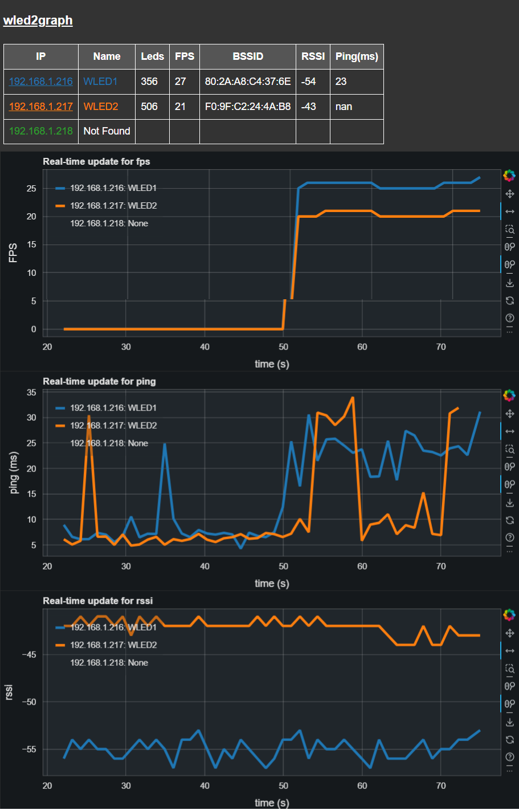

# wled2graph

wled2graph is a Python program designed to visualize Frames Per Second (FPS) data and other from WLED endpoints on a network in real-time using a Bokeh graph server. It sets up a polling loop, defaulting to every 5 seconds, to fetch the current JSON state from each specified WLED endpoint



## Features

- **Real-time FPS, BSSID, RSSI and Ping Visualization**: Continuously polls WLED endpoints and updates the graph with current FPS values.
- **IP address hyperlink to WLED UI**: Just click through direct to the WLED UI for the selected WLED endpoint.
- **Configurable Polling Frequency**: Allows customization of the polling interval to suit network and performance needs.
- **Scalable**: Can monitor multiple WLED endpoints simultaneously.
- **Customizable Data Points Rollover**: Supports setting a maximum number of data points to display on the graph, after which old data points are rolled off.


## Installation from PyPi

```bash
pip install wled2graph
```

WLED2Graph is executed from the command line and requires a list of IP addresses corresponding to the WLED endpoints you wish to monitor.

```bash
wled2graph -w <WLED_IPs> [-t <time_period>] [-r <rollover>]
```

-w, --wleds: A comma-separated list of IP addresses for the WLED endpoints.  
-t, --time-period: (Optional) The time period in seconds for polling the WLEDs. Default is 5 seconds.  
-r, --rollover: (Optional) The number of data points to keep in the graph before rolling over. Default is 20000.  

### Example
To start monitoring two WLED endpoints with a polling interval of 10 seconds:

```bash
wled2graph -w 192.168.1.100,192.168.1.101 -t 10
```

To start monitoring five WLED endpoints with a polling interval of 1 seconds and a data point rollover of 30:

```bash
wled2graph -w "192.168.1.216, 192.168.1.217, 192.168.1.220, 192.168.1.229, 192.168.1.230" -t 1 -r 30
```

# How to develop on wled2graph
## Prerequisites

Before you begin, ensure you have met the following requirements:

- Python 3.9 or higher
- [Poetry](https://python-poetry.org/docs/#installation), a tool for dependency management in Python projects.

1. Clone the repository to your local machine:

    ```bash
    git clone https://github.com/bigredfrog/wled2graph.git
    cd wled2graph
    ```

2. Install the project dependencies using Poetry:

    ```bash
    poetry install
    ```

    This will create a virtual environment and install the necessary Python libraries.

## Development Usage

WLED2Graph is executed from the command line and requires a list of IP addresses corresponding to the WLED endpoints you wish to monitor.

```bash
poetry run python main.py -w <WLED_IPs> [-t <time_period>] [-r <rollover>]
```

-w, --wleds: A comma-separated list of IP addresses for the WLED endpoints.  
-t, --time-period: (Optional) The time period in seconds for polling the WLEDs. Default is 5 seconds.  
-r, --rollover: (Optional) The number of data points to keep in the graph before rolling over. Default is 20000.  

### Example
To start monitoring two WLED endpoints with a polling interval of 10 seconds:

```bash
poetry run python main.py -w 192.168.1.100,192.168.1.101 -t 10
```

To start monitoring five WLED endpoints with a polling interval of 1 seconds and a data point rollover of 30:

```bash
poetry run python main.py -w "192.168.1.216, 192.168.1.217, 192.168.1.220, 192.168.1.229, 192.168.1.230" -t 1 -r 30
```
## Contributing
I just don't know if this has legs right now...

## License
This project is licensed under the MIT License - see the LICENSE.md file for details.

https://github.com/bigredfrog/wled2graph/blob/master/license.md
